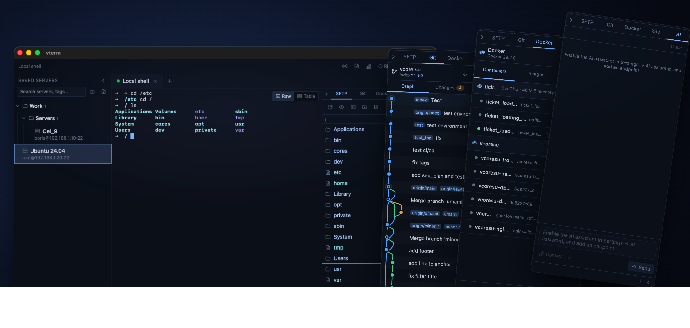

<div align="center">

# vterm

**Кроссплатформенный SSH-терминал и SFTP-клиент для системных администраторов, DevOps и SRE.**

Графический инструмент: слева — список серверов, справа — живой
терминал, плюс передача файлов по SFTP, встроенный редактор конфигов, мониторинг и
запись сессий. Написан на **Rust** поверх **Tauri 2** и **SvelteKit**.


[](LICENSE)


</div>

---
### [⬇️ Скачать последнюю версию](https://github.com/BorisToboltsov/vterm/releases/latest)




---

## Возможности

#### 🔌 Подключение
SSH по паролю и ключу, вкладки, локальный шелл (выбор оболочки).
Proxy на каждый сервер — jump host, SOCKS5, HTTP CONNECT. Окно ожидания и переподключение.

#### 📁 Файлы и конфиги
SFTP с drag-and-drop и прогрессом (скорость, ETA). Редактор на CodeMirror (50+ языков):
diff перед сохранением, линт, sudo-правка root-конфигов, markdown-превью, синхронизация папок, grep.

#### 🧭 DevOps-панели
**Git**, **Docker** и **Kubernetes** по текущему пути терминала — на SSH и локально:
граф и ветки, контейнеры и compose, поды и нагрузки, shell/exec и port-forward, диффы, логи.
Деструктив на прод-серверах — с подтверждением.

#### 📈 Наблюдаемость
KPI-дашборд (ЦП / ОЗУ / сеть / температуры / health) и статус-бар с порогами — по SSH и локально.
Запись сессий (asciicast) с плеером и экспортом в runbook / скрипт / транскрипт.

#### 🤖 ИИ-ассистент · опционально, выкл. по умолчанию
Локальный (Ollama, LM Studio, vLLM) или облачный (DeepSeek, OpenAI, Claude) эндпоинт на выбор.
Чат с выполнением команд, разбор логов и метрик — через маскирование секретов и окно согласия.

#### 🧰 Утилиты · офлайн
Генерация SSH-ключей, менеджер known_hosts, Base64 / CIDR / cron / JWT, генератор паролей.
Сетевые пробы (TLS-инспектор, HTTP-клиент) — на хосте активной сессии, не из приложения.

#### ⚡ Продуктивность
Синхронный ввод на несколько серверов, командная палитра ⌘K, история по Ctrl+R,
заметки к серверу (Markdown), структурный просмотр логов, заставки простоя.

#### 🎨 Оформление и приватность
Темы терминала и UI (включая фирменные с объёмным фоном), i18n (EN / RU), доступность.
Секреты — в системном keychain. **Офлайн по умолчанию** (кроме SSH и опц. ИИ).

📖 **Полное описание возможностей и горячих клавиш — в [docs/GUIDE.md](docs/GUIDE.md)**

---

## Установка

Готовые сборки для **macOS** (`.dmg` + хелпер `open-on-mac.sh`), **Windows**
(`.msi` / установщик `.exe` / **portable** `.exe` — без установки)
и **Linux** (`.deb` / `.rpm` / AppImage) — на странице релизов:

### [⬇️ Скачать последнюю версию](https://github.com/BorisToboltsov/vterm/releases/latest)

Сборки не подписаны — как снять предупреждение ОС при первом запуске, см.
[docs/INSTALL.md](docs/INSTALL.md).

## Сборка из исходников

```bash
pnpm install      # JS-зависимости
pnpm tauri dev    # dev-режим (первая Rust-сборка ~1–2 мин)
```

Нужны **Node.js 20+**, **pnpm** и **Rust stable**. Подробно — установка на Windows
с нуля и сборка дистрибутивов — в [docs/INSTALL.md](docs/INSTALL.md).

---

## Документация

Каждый документ отвечает на один вопрос — открывайте тот, чей вопрос ваш:

| Вопрос | Документ |
|--------|----------|
| Что программа умеет и какие горячие клавиши? | [docs/GUIDE.md](docs/GUIDE.md) — то же руководство открывается **внутри приложения** |
| Как поставить, собрать, выпустить релиз? | [docs/INSTALL.md](docs/INSTALL.md) |
| Не запускается, не собирается, ошибка при старте | [docs/TROUBLESHOOTING.md](docs/TROUBLESHOOTING.md) |
| Из чего это собрано и как связано? | [docs/ARCHITECTURE.md](docs/ARCHITECTURE.md) — стек, граница фронт/бэк, каналы, подсистемы |
| Что здесь нельзя делать и почему? | [docs/INVARIANTS.md](docs/INVARIANTS.md) — контракты кодовой базы |
| Почему решено именно так? | [docs/adr/](docs/adr/) — записи о ключевых решениях |
| Как это выглядит: токены, кнопки, отступы? | [docs/DESIGN.md](docs/DESIGN.md) |
| Что уже сделано и что дальше? | [docs/ROADMAP.md](docs/ROADMAP.md) · [CHANGELOG.md](CHANGELOG.md) |
| Как гоняются тесты? | [docs/TESTS.md](docs/TESTS.md) |
| Как это защищено? | [SECURITY.md](SECURITY.md) |
| Хочу поучаствовать | [CONTRIBUTING.md](CONTRIBUTING.md) |

> **Собираетесь писать код или документацию?** Правила процесса и карта «что в какой файл
> писать» — в [CLAUDE.md](CLAUDE.md). Жанр у каждого документа один, и дублировать мысль
> между ними нельзя: вместо копии ставится ссылка.

---

## Сеть и автономность

**Полностью офлайн.** Единственный сетевой трафик — исходящий SSH к вашим серверам
(и, если включите ИИ, запросы к вашему эндпоинту). Ни CDN, ни телеметрии, ни
аналитики; шрифты встроены, секреты — в системном keychain. Инвариант закреплён
тест-гейтами — см. [SECURITY.md](SECURITY.md).

---

## Контакты · Лицензия

**Telegram** [@BorisToboltsov](https://t.me/BorisToboltsov) ·
**Email** [bt@vcore.su](mailto:bt@vcore.su)

[MIT](LICENSE) © 2026 Тобольцов Борис Олегович
