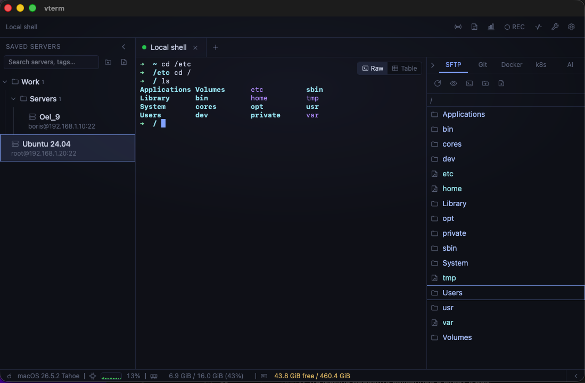
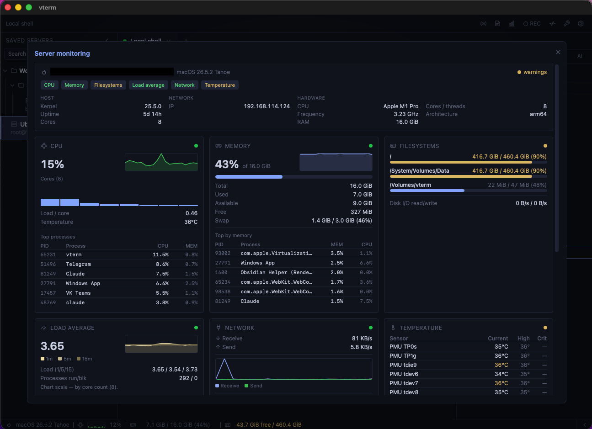
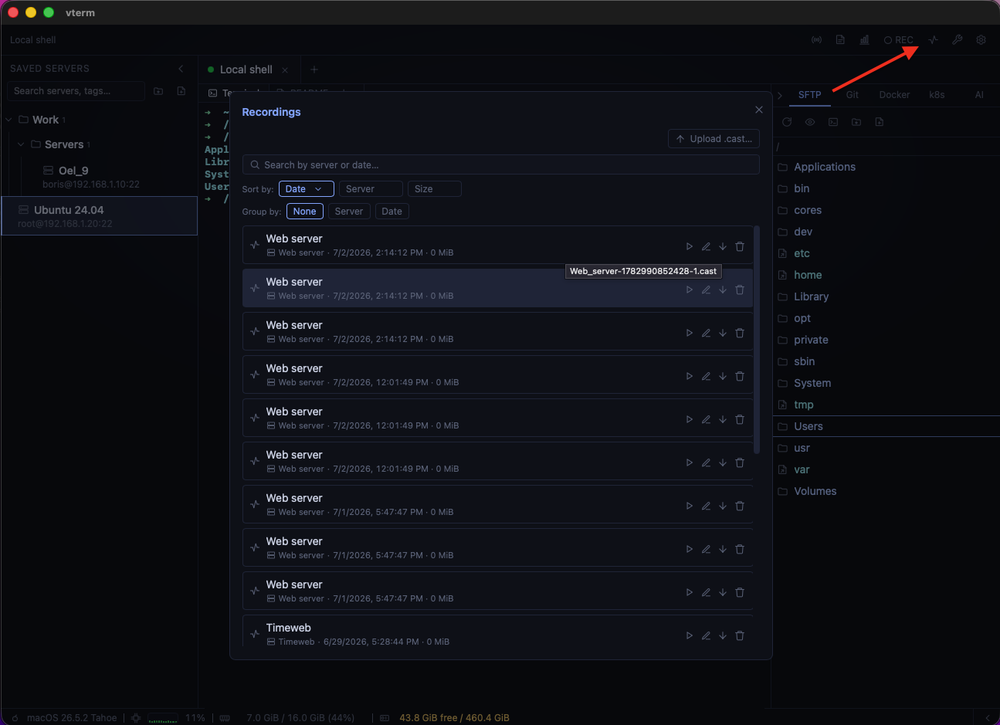

<div align="center">

# vterm

**Кроссплатформенный SSH-терминал и SFTP-клиент для системных администраторов, DevOps и SRE.**

Графический инструмент: слева — список серверов, справа — живой
терминал, плюс передача файлов по SFTP, встроенный редактор конфигов, мониторинг и
запись сессий. Написан на **Rust** поверх **Tauri 2** и **SvelteKit**.


[](LICENSE)


</div>

---

## Скриншоты

> 🖼️ _Скриншоты будут добавлены._ Файлы кладутся в [docs/screenshots/](docs/screenshots/);
> разметка уже заготовлена ниже — раскомментируйте по мере появления изображений.

<!--

*Двухпанельное окно: дерево серверов и живой терминал.*


*SFTP-менеджер и встроенный редактор (CodeMirror) с подсветкой и diff.*


*KPI-дашборд мониторинга: блок «Система», графики, температуры, health-сводка.*


*Библиотека записей asciicast и встроенный плеер.*
-->

---

## Возможности

- 🔌 **SSH** (russh) по паролю и ключу, с дефолтным ключом из `~/.ssh/`, вкладками,
  локальным терминалом, окном ожидания/ошибки и переподключением.
- 🛡️ **Proxy / jump host** на каждой записи сервера: подключение через промежуточный
  хост — **SSH jump host** (`ssh -J`), **SOCKS5** и **HTTP CONNECT**.
- 📡 **Синхронный ввод на несколько серверов**: команда из одного поля уходит сразу на
  все выбранные сессии; сетка терминалов или «фокус + список» для большого числа хостов;
  отправка на prod-сервер требует подтверждения.
- 📝 **Заметки к серверу** (Markdown): большое окно-редактор с переключателем
  Редактор/Просмотр и автосохранением; открывается из верхней полосы по выделению
  сервера, хранится в профиле и попадает в бэкап.
- 🎨 **Пиктограммы серверов**: иконка (набор ~24 глифа) и цвет на каждый профиль —
  показываются перед именем в списке для быстрого поиска глазами.
- 🔐 **Секреты в системном keychain** (macOS Keychain / Windows Credential Manager /
  Linux Secret Service), профили в JSON, проверка отпечатка хоста.
- 📁 **SFTP-менеджер**: обзор, навигация, upload/download, drag-and-drop, прогресс.
- 📝 **Редактор конфигов** (CodeMirror, 50+ языков): правка файлов на сервере и
  локально, diff перед сохранением, линт (локальный и серверный — вкл. проверку
  конфигов демонов `sshd`/`sudoers`/`haproxy`/BIND/systemd их родными командами и
  YAML-семейство `docker-compose`/Ansible/Kubernetes/GitHub Actions/Prometheus),
  markdown-превью, sudo-правка root-конфигов, синхронизация папок по SHA-256, grep по содержимому.
- 📈 **Мониторинг**: KPI-дашборд (блок «Система», графики ЦП/ОЗУ/сети, температуры,
  SMART/Docker/GPU, health-сводка) + нижний статус-бар с порогами.
- 🔎 **Логи и текст**: поиск по всему буферу, regex-подсветка, структурный
  (табличный) просмотр JSON/logfmt/syslog/nginx/dmesg.
- ⌨️ **История команд по Ctrl+R**: окно reverse-search по файлу истории шелла
  (фильтр, ↑/↓, Enter — вставка команды в строку).
- ⏺️ **Запись сессий** (asciicast v2): библиотека (поиск, сортировка, группировка по
  серверу/дате), встроенный плеер, экспорт
  (Markdown-ранбук/команды/транскрипт/`.cast`), автозапись прод-серверов.
- 🤖 **ИИ-ассистент** (опционально, выключен по умолчанию, **в разработке**): чат во
  вкладке правой панели; **локальный** (Qwen/Ollama) или **облачный** (Claude) эндпоинт по
  выбору; весь трафик — через бэкенд только на ваш эндпоинт, ключи в keychain. Проверка подключения
  и **список моделей сервера** (выбор модели прямо в чате).
  Контекст сессии (выделение/буфер/запись/метаданные) — по желанию, с **маскированием
  секретов** и **окном согласия** перед отправкой; флаг сервера **«Запретить ИИ»** полностью
  отключает контекст и исполнение (прод-защита). Предложенные команды — с кнопкой
  **«Выполнить»** (режимы: только предлагать / подтверждать каждую / авто на не-прод), запуск
  пишется в запись сессии как аудит; разрушительные команды в авто-режиме всё равно требуют
  подтверждения — список встроенный и **расширяется своими подстроками** в настройках. Из записи сессии ИИ собирает **план-runbook** или **скрипт
  `sh`/Ansible**, открывая его в редакторе с линтом.
- 🎨 **UX**: темы (терминал + UI), командная палитра ⌘K, **навигация списка серверов с
  клавиатуры** (`↑`/`↓` — рамка-курсор, `Enter` — подключить / свернуть папку, `Delete` —
  удалить), доступность (a11y), i18n (English/Русский), бэкап настроек, **офлайн по
  умолчанию** (кроме SSH и опц. ИИ).

📖 **Полное описание возможностей и горячих клавиш — в [docs/GUIDE.md](docs/GUIDE.md)**
(эта же страница встроена в приложение: Help → «Инструкция»).

---

## Быстрый старт

```bash
pnpm install      # JS-зависимости
pnpm tauri dev    # запуск в режиме разработки (первая Rust-сборка ~1–2 мин)
```

Нужны **Node.js 20+**, **pnpm** и **Rust stable** (rustup). Полные требования,
установка на Windows с нуля, сборка дистрибутивов и запуск готового приложения —
в [docs/INSTALL.md](docs/INSTALL.md).

---

## Документация

| Документ | О чём |
|----------|-------|
| [docs/GUIDE.md](docs/GUIDE.md) | Руководство пользователя: возможности, горячие клавиши |
| [docs/INSTALL.md](docs/INSTALL.md) | Требования, установка, сборка, запуск, CI |
| [docs/TROUBLESHOOTING.md](docs/TROUBLESHOOTING.md) | Решение частых проблем |
| [docs/ARCHITECTURE.md](docs/ARCHITECTURE.md) | Архитектура, инварианты, стек, структура каталогов |
| [docs/DESIGN.md](docs/DESIGN.md) | Дизайн-система (закреплено) |
| [docs/ROADMAP.md](docs/ROADMAP.md) | План по фазам · [CHANGELOG.md](CHANGELOG.md) — история |
| [docs/TESTS.md](docs/TESTS.md) | Тестирование: слои, запуск, покрытие, CI |
| [CLAUDE.md](CLAUDE.md) | Правила разработки (для ИИ-ассистента и контрибьюторов) |
| [CONTRIBUTING.md](CONTRIBUTING.md) · [SECURITY.md](SECURITY.md) | Как контрибьютить · модель безопасности |

---

## Сеть и автономность

vterm работает **полностью офлайн**. Единственный сетевой доступ — исходящие
**SSH-подключения к серверам, которые вы сами добавили**. Соединение с эндпоинтом ИИ если вы его добавили. Нет CDN, телеметрии и
аналитики; шрифты встроены, секреты — локально в системном keychain. Инвариант
закреплён тест-гейтами (подробнее — в [docs/GUIDE.md](docs/GUIDE.md) и
[SECURITY.md](SECURITY.md)).

---

## Контакты разработчика

- **Telegram:** [@BorisToboltsov](https://t.me/BorisToboltsov)
- **Email:** [bt@vcore.su](mailto:bt@vcore.su)

---

## Лицензия

[MIT](LICENSE) © 2026 Тобольцов Борис Олегович
